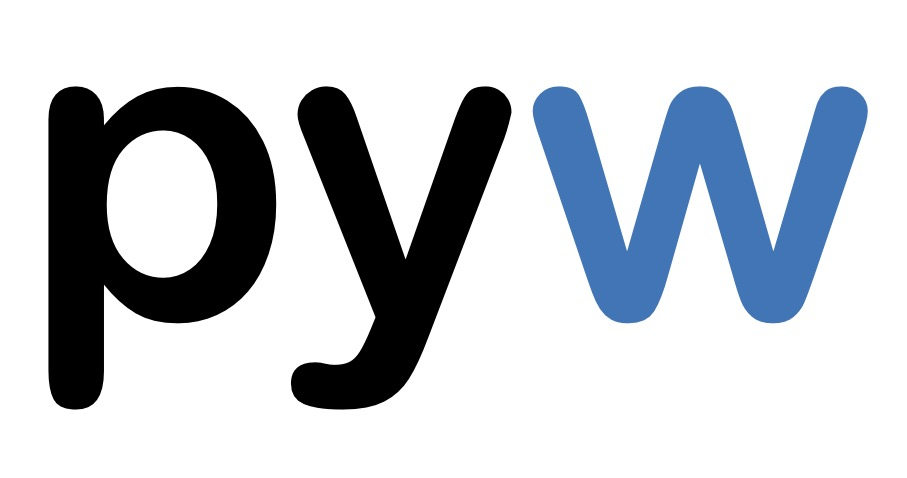

[](https://codecov.io/gh/neutrinoceros/pyw)
[](https://results.pre-commit.ci/latest/github/neutrinoceros/pyw/master)
[](https://github.com/psf/black)

pyw is a command line tool to interogate your Python installation.
In essence,

```shell
$ pyw pandas
```
is equivalent to
```shell
$ python -c "import pandas; print(pandas.__file__)"
```

pyw can also be used to navigate source code, by locating classes and functions by `file:line

```shell
$ pyw pandas.DataFrame
/Users/yourname/miniconda3/envs/production/lib/python3.8/site-packages/pandas/core/frame.py:319
```

## Installation

### Usage

``pyw``'s command line application shines most if you use isolated Python
environments. In order to make it available from anywhere on your system and
against the current environment run
```shell
$ python install_app.py
```
:warning: Currently only Linux and MacOS are supported. On Windows, it is still
possible to install `pyw` on an specific environment by installing it as a
Python package (see next section).

### Python api

From the top level of the repo, run
```shell
$ pip install -e .
```

This will make `pyw`'s internal functionalities available from a Python
session in the current environment.


## Usage

Examples

```shell
$ pyw numpy
/Users/yourname/miniconda3/envs/production/lib/python3.8/site-packages/numpy

$ pyw pandas --version
1.0.3

$ pyw yt --info
scope_name: yt
package_name: yt
is_stdlib: False
is_available: True
module_name: yt
is_module: True
version: 4.0.dev0
path: /Users/clm/dev/python/yt-project/yt/yt/__init__.py
line: 0
last_updated: 2021-02-01 19:09:24
git_hash: 0d31a4a14ce254fbad356a4c1d50bbe41beed6da

$ pyw yt --json
{
  "scope_name": "yt",
  "package_name": "yt",
  "is_stdlib": false,
  "is_available": true,
  "module_name": "yt",
  "is_module": true,
  "version": "4.0.dev0",
  "path": "/Users/clm/dev/python/yt-project/yt/yt/__init__.py",
  "line": 0,
  "last_updated": "2021-02-01 19:09:24",
  "git_hash": "0d31a4a14ce254fbad356a4c1d50bbe41beed6da"
}
```

## Notes
- the Python api is tested on macOS, Linux and Windows, for Python 3.6 and 3.9
  Note that with Python versions older than 3.8, installing `importlib-metadata`
  helps to discover the version number in certain projects.
- pyw relies on [stdlib_list](https://github.com/jackmaney/python-stdlib-list)
  to determine which packages are part of the standard library.
- pyw tries to determine the source file from which the object is imported. In
  some cases (e.g. for the standard library on Windows), it will fall back to a
  directory.
- this project was formally named "whych" and renamed to avoid confusion with the
  pypi-available package of the same name.
